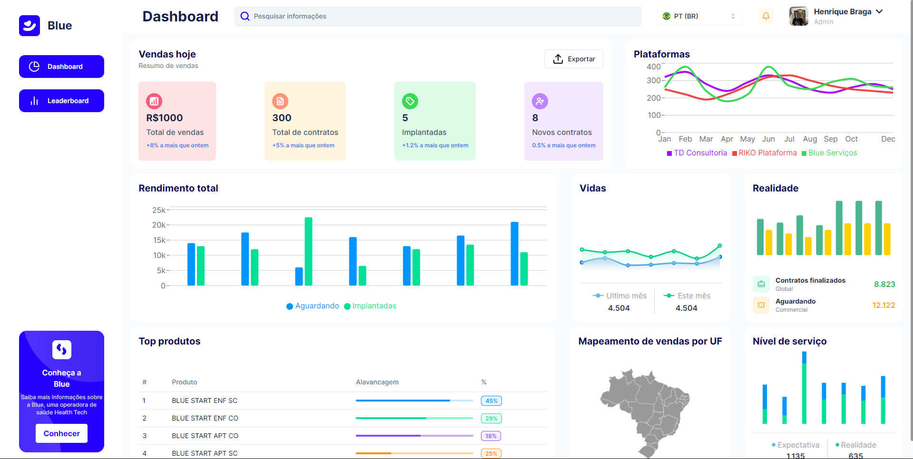

# Desafio Front-End

Esta é uma aplicação front-end composta por uma tela de login e um dashboard. Após o login, o usuário é redirecionado para o dashboard principal da aplicação. A aplicação está hospedada na Vercel e pode ser acessada [aqui](https://desafio-front-end-dusky.vercel.app/).

## Login de Acesso

Para entrar na aplicação, utilize as seguintes credenciais:

- **Username:** ADMIN
- **Password:** 12345678

## Stack Utilizada

A aplicação foi construída utilizando as seguintes tecnologias e bibliotecas:

- **Next.js**: 14.2.3
- **React**: 18
- **React-DOM**: 18
- **Hono**
- **TailwindCSS**
- **React Hook Form**
- **TanStack React Query**
- **TanStack React Table**
- **Recharts**
- **Zod**
- **Radix UI**
- **Vitest** para testes

## Scripts Disponíveis

- `dev`: Inicia a aplicação em modo de desenvolvimento.
- `build`: Compila a aplicação para produção.
- `start`: Inicia a aplicação em modo de produção.
- `lint`: Executa o ESLint para análise de código.
- `prepare`: Instala o Husky para pre-commit hooks.
- `commit`: Utiliza o Commitizen para mensagens de commit.
- `test`: Executa os testes utilizando o Vitest.

## Configuração

### Pré-requisitos

- Node.js (versão 14 ou superior)
- PNPM (preferencialmente)

### Instalação

1. Clone o repositório:

   ```sh
   git clone https://github.com/seu-usuario/desafio-front-end.git
   ```

2. Navegue até o diretório do projeto:

   ```sh
   cd desafio-front-end
   ```

3. Instale as dependências:

   ```sh
   pnpm install
   ```

## Variáveis de Ambiente

Crie um arquivo .env.local na raiz do projeto e adicione as seguintes variáveis de ambiente:

```sh
NEXT_PUBLIC_BASE_URL="http://localhost:3000/"
NEXT_PUBLIC_SECRET_KEY='blue_company-secret'
```

### Executando a Aplicação

Para iniciar a aplicação em modo de desenvolvimento, utilize o seguinte comando:

```sh
pnpm dev
```

A aplicação estará disponível em http://localhost:3000.

### Executando Testes

Para rodar os testes, utilize o comando:

```sh
pnpm test
```

### Commitizen

Para fazer commits utilizando o Commitizen, utilize:

```sh
pnpm commit
```

## Contribuição

Contribuições são bem-vindas! Por favor, siga as diretrizes de commit utilizando o Commitizen e assegure-se de que o código está devidamente lintado e testado antes de abrir um Pull Request.

## Deploy

A aplicação está configurada para ser facilmente implantada na Vercel. Após configurar o projeto na Vercel, qualquer push para o branch principal (main) acionará um novo deploy automático.
